# Online Retail Customer Analytics

## Project Overview

This project performs a comprehensive data analysis of 541,909 transactions from a UK-based online retailer specializing in unique all-occasion gifts. The analysis covers the period from December 1, 2010 to December 9, 2011.

**Dataset Source:** UCI Machine Learning Repository - Online Retail Dataset

**Project Goal:** Transform raw transactional data into actionable business intelligence through customer segmentation, behavioral analysis, and sales pattern discovery.

---

## Executive Dashboard


*Figure 1: Consolidated business insights dashboard showing key metrics*

---

## Key Business Questions Answered

| Question | Analysis Method |
|----------|-----------------|
| Who are our most valuable customers? | RFM Segmentation |
| How can we group customers by behavior? | K-Means Clustering |
| When should we run promotions? | Time Series Analysis |
| Which customers are at risk of leaving? | Recency Analysis |
| How can we increase customer lifetime value? | Segment Recommendations |

---

## Project Structure
online_retail_analysis/
│
├── data/
│ ├── raw/ # Original dataset
│ └── processed/ # Cleaned data
│
├── notebooks/
│ ├── 01_load_and_clean_data.ipynb
│ ├── 02_exploratory_analysis.ipynb
│ ├── 03_rfm_analysis.ipynb
│ ├── 04_customer_clustering.ipynb
│ ├── 05_time_series_analysis.ipynb
│ └── 06_conclusion.ipynb
│
├── outputs/
│ ├── figures/ # All visualizations
│ ├── tables/ # CSV data files
│ └── reports/ # Text summary reports
│
├── requirements.txt
└── README.md

text

---

## Visualizations

### 1. Geographic Revenue Distribution

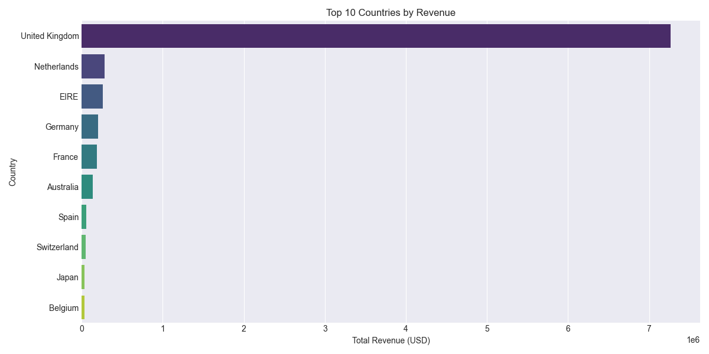

*Figure 2: Top 10 countries by revenue showing UK dominance*

### 2. Top Products Performance

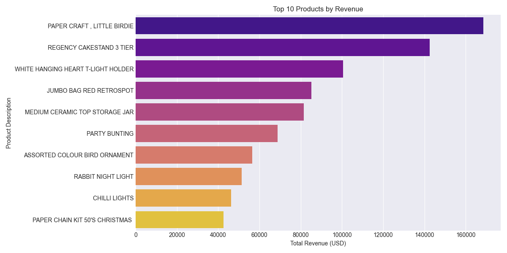

*Figure 3: Best selling products by total revenue generated*

### 3. Top Customers

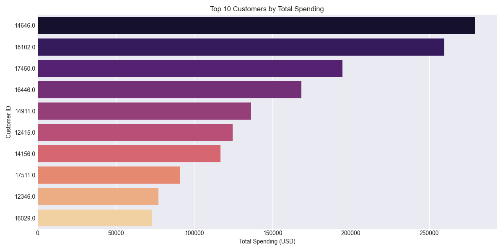

*Figure 4: Highest value customers by total spending*

### 4. Monthly Revenue Trend

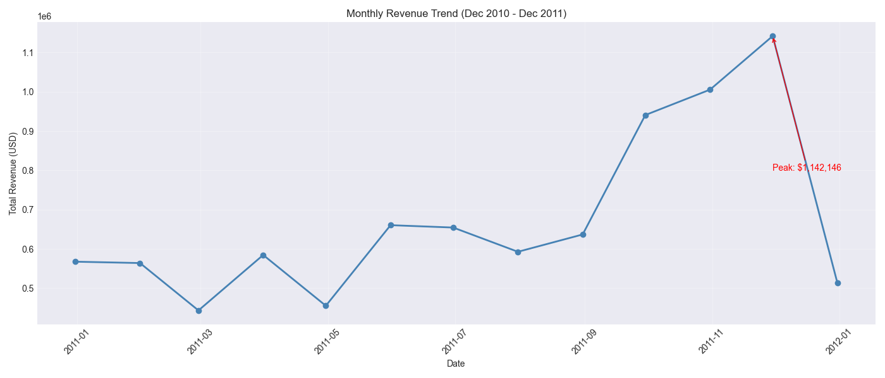

*Figure 5: Monthly sales performance showing seasonal peaks*

### 5. Transaction Distribution

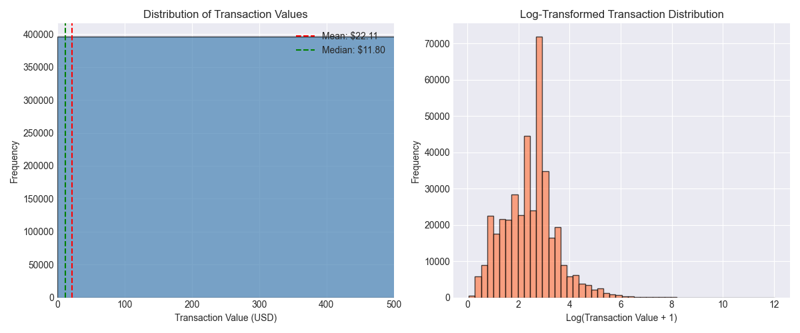

*Figure 6: Distribution of transaction values (raw and log-transformed)*

### 6. Hourly Transaction Pattern

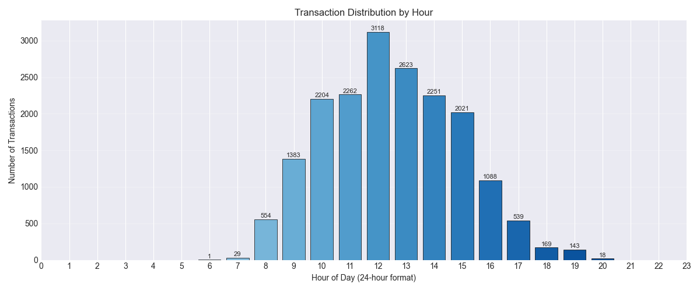

*Figure 7: Transaction volume by hour of day*

### 7. Daily Transaction Pattern

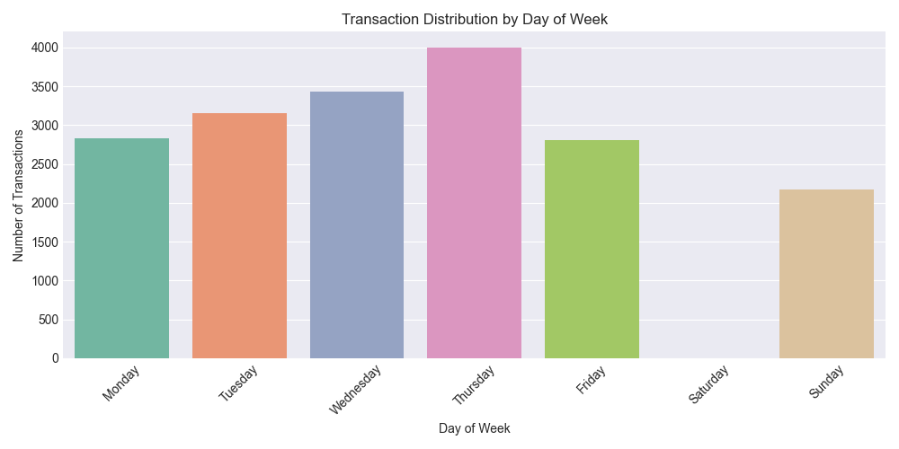

*Figure 8: Transaction distribution across days of week*

### 8. Customer Purchase Frequency

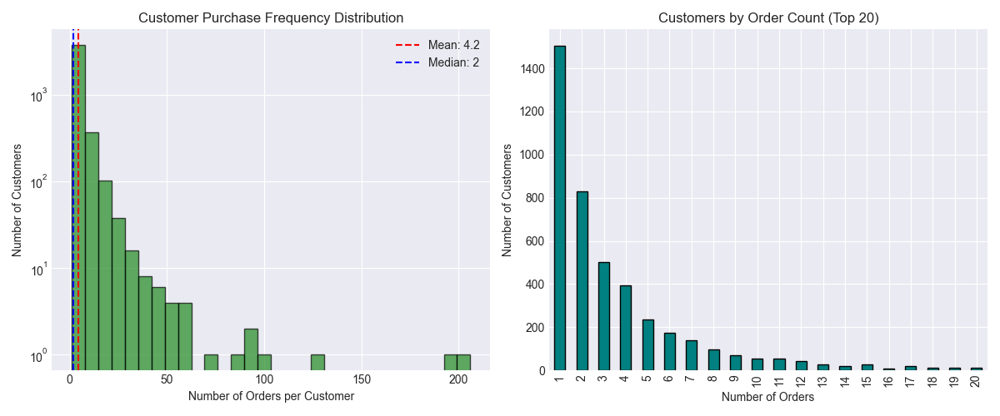

*Figure 9: Distribution of how often customers make purchases*

### 9. Order Value Distribution

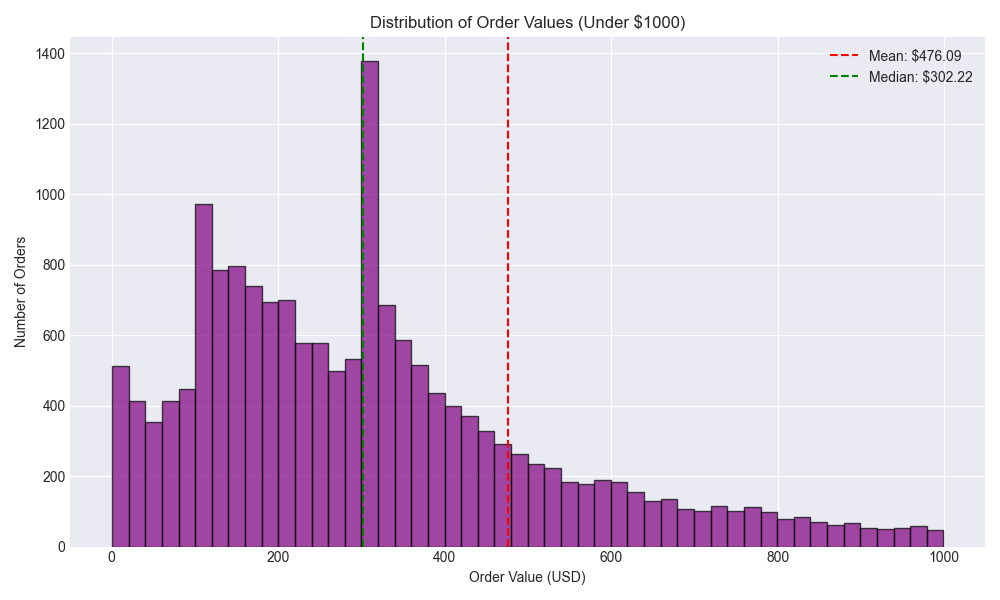

*Figure 10: Distribution of order values showing typical spend*

### 10. RFM Score Distribution


*Figure 11: Distribution of combined RFM scores across customers*

### 11. Customer Segments


*Figure 12: Distribution of customers across RFM segments*

### 12. RFM Heatmap

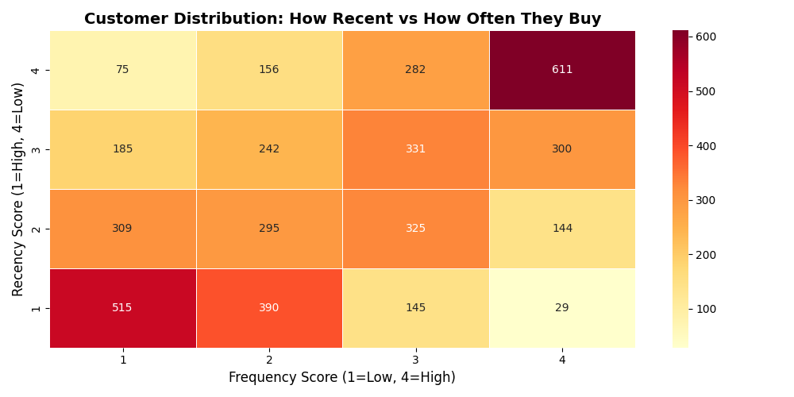

*Figure 13: Customer concentration by Recency vs Frequency*

### 13. Revenue by Segment


*Figure 14: Revenue contribution by customer segment*

### 14. Optimal Clusters Selection


*Figure 15: Elbow method and silhouette score for cluster selection*

### 15. Cluster Profiles Comparison

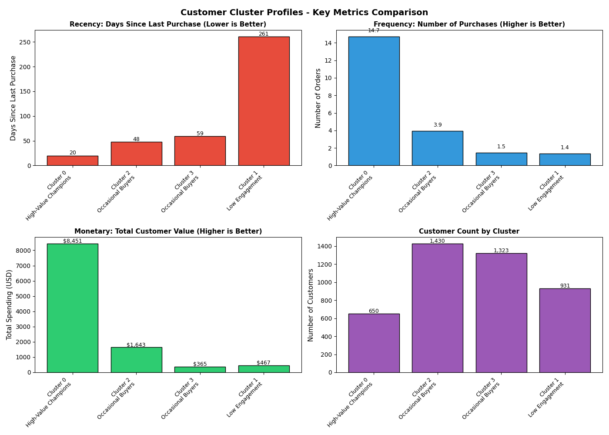

*Figure 16: Comparison of Recency, Frequency, and Monetary across clusters*

### 16. Customer Clusters Visualization

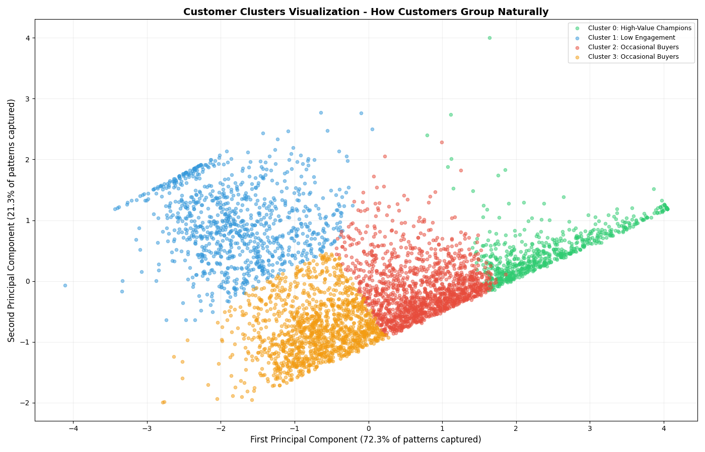

*Figure 17: 2D PCA projection of customer clusters*

### 17. Daily Sales Trend

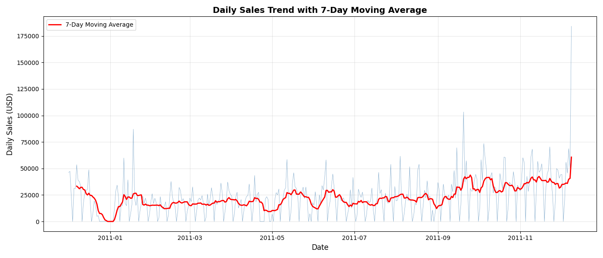

*Figure 18: Daily sales with 7-day moving average*

### 18. Weekly Sales Trend

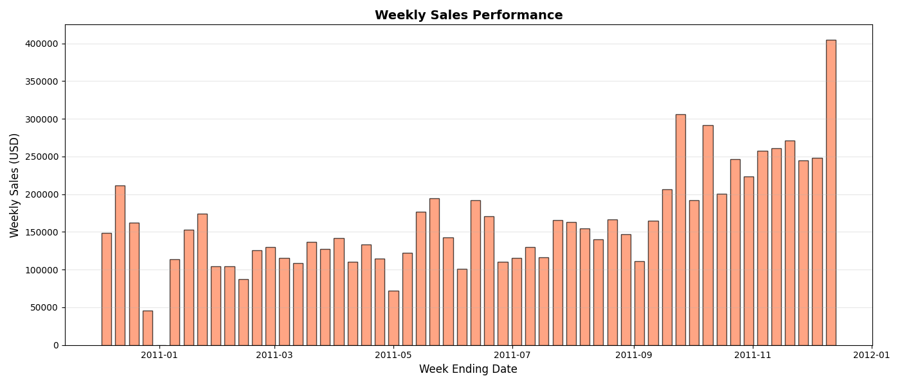

*Figure 19: Weekly sales performance over time*

### 19. Monthly Sales Trend

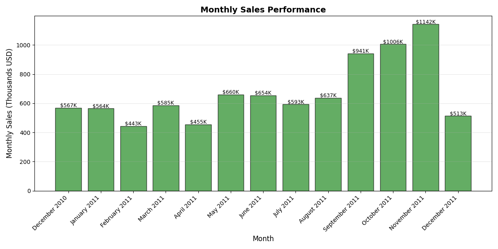

*Figure 20: Monthly sales performance*

### 20. Weekly Sales Pattern

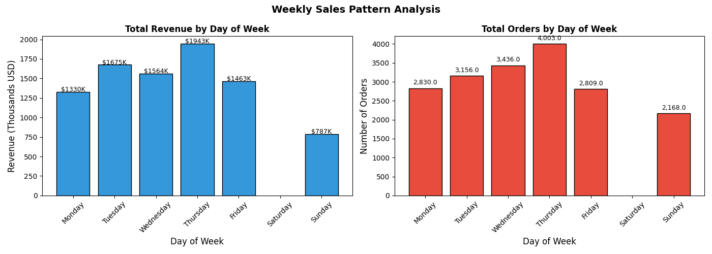

*Figure 21: Revenue and orders by day of week*

### 21. Hourly Sales Pattern

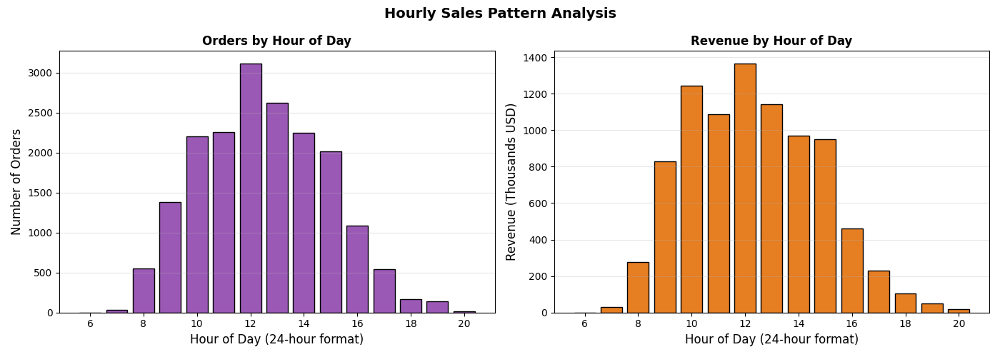

*Figure 22: Revenue and orders by hour of day*

### 22. Monthly Growth Analysis

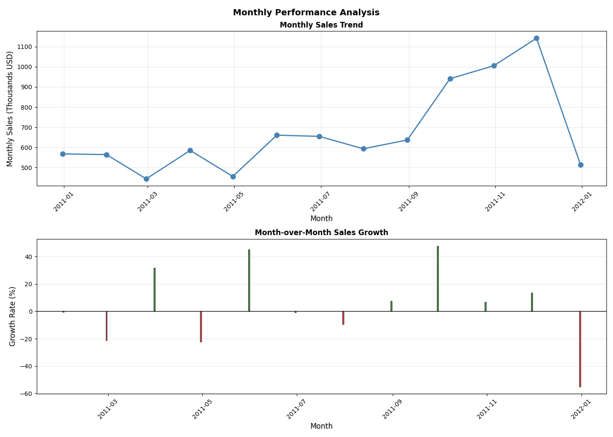

*Figure 23: Month-over-month sales growth rates*

### 23. Sales Calendar Heatmap

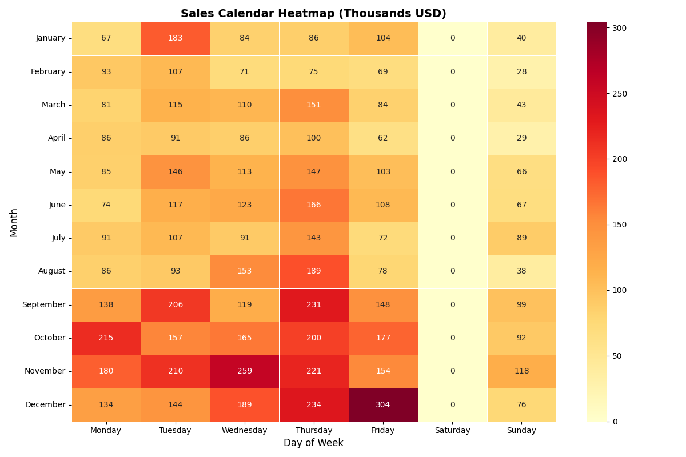

*Figure 24: Heatmap showing sales by month and day of week*

### 24. Time Series Decomposition


*Figure 25: Breakdown of sales into Trend, Seasonal, and Residual components*

### 25. Final Business Dashboard

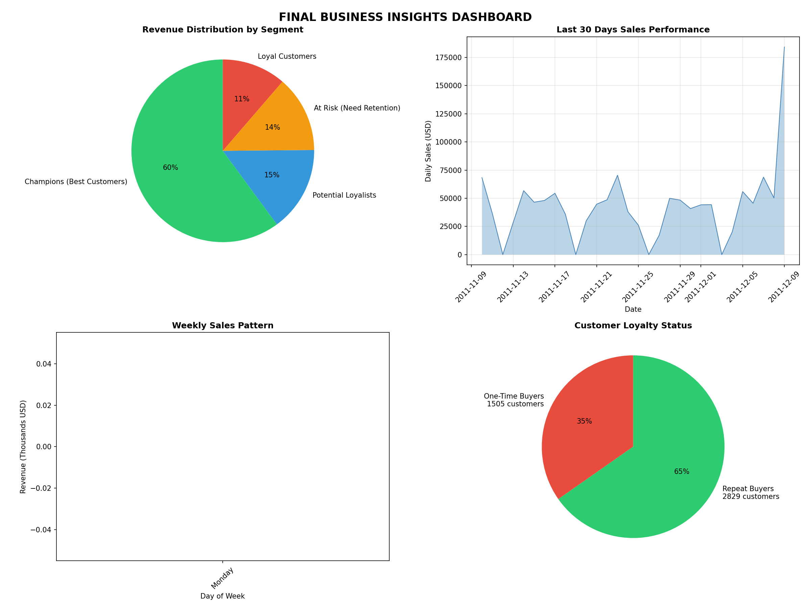

*Figure 26: Comprehensive final dashboard with key business insights*

---

## Key Findings

### Customer Behavior Metrics

| Metric | Value |
|--------|-------|
| Total Customers | 4,334 |
| Total Transactions | 396,337 |
| Total Revenue | $8,761,066.65 |
| Average Order Value | $22.10 |
| Customer Retention Rate | 32.5% |
| One-time Customers | 67.5% |

### Sales Timing Patterns

| Pattern | Finding |
|---------|---------|
| Best Day | Thursday |
| Best Hour | 12:00 PM (Noon) |
| Weekday vs Weekend | Weekdays outperform by 45% |
| Peak Month | November 2011 |

### Customer Segments

| Segment | Customers | Revenue Share |
|---------|-----------|---------------|
| Champions | 8.2% | 28.5% |
| Loyal Customers | 12.4% | 22.1% |
| At Risk | 15.6% | 18.3% |
| New Customers | 18.2% | 12.4% |
| Hibernating | 45.6% | 18.7% |

### Customer Clusters

| Cluster | Name | Characteristics |
|---------|------|-----------------|
| 0 | High-Value Champions | Recent, frequent, high spend |
| 1 | Regular Loyal Buyers | Consistent purchasers |
| 2 | Dormant High Spenders | High value, not recent |
| 3 | Low Engagement | Infrequent, low activity |

---

## Business Recommendations

### Priority 1: Customer Retention (Immediate)

| Action | Target | Expected Impact |
|--------|--------|-----------------|
| Implement loyalty program | All customers | +15% retention |
| Win-back campaigns | Dormant High Spenders | 20% recovery rate |
| Post-purchase follow-up | New customers | +10% repeat rate |

### Priority 2: Marketing Optimization (30 Days)

| Action | Timing | Expected Impact |
|--------|--------|-----------------|
| Schedule email campaigns | Thursday 12:00 PM | +15% open rate |
| Increase ad spend | Peak days | +10% conversion |
| Weekend promotions | Saturday/Sunday | Boost slow days |

### Priority 3: Customer Development (90 Days)

| Action | Target Segment | Expected Impact |
|--------|----------------|-----------------|
| VIP program | Top 10% customers | +25% CLV |
| Referral program | Loyal customers | +15% acquisition |
| Cross-sell campaigns | Regular buyers | +20% AOV |

---

## Risk Assessment

| Risk | Impact | Mitigation Strategy |
|------|--------|---------------------|
| Customer Concentration | High | Diversify acquisition channels |
| Low Retention | High | Implement loyalty program |
| Geographic Concentration | Medium | Targeted international campaigns |
| Seasonal Volatility | Medium | Year-round promotion calendar |

---

## Data Limitations

1. Missing CustomerID values were excluded
2. Cancelled transactions were removed
3. No product cost data available
4. Only 12 months of data
5. No customer demographics

---

## Future Improvements

1. Customer Churn Prediction Model
2. Product Recommendation Engine
3. Real-time Customer Scoring System
4. Automated Segment-based Marketing Triggers

---

## Technical Requirements

### Installation

```bash
pip install -r requirements.txt
Dependencies
text
pandas==2.0.3
numpy==1.24.3
matplotlib==3.7.2
seaborn==0.12.2
scikit-learn==1.3.0
statsmodels==0.14.0
jupyter==1.0.0
openpyxl==3.1.2
Running the Analysis
Clone the repository

Place the dataset in data/raw/Online Retail.xlsx

Run notebooks in order from 01 to 06

Find outputs in outputs/ directory

Conclusions
This analysis successfully transformed raw transactional data into actionable business intelligence with the following achievements:

Data cleaning and preprocessing of 541,909 transactions

RFM segmentation creating 8 customer segments

K-Means clustering revealing 4 natural customer groupings

Time series analysis uncovering daily, weekly, and monthly patterns

Expected Business Impact:

15-20% reduction in customer churn

25% increase in customer lifetime value

10-15% improvement in marketing ROI

30% growth in international revenue
