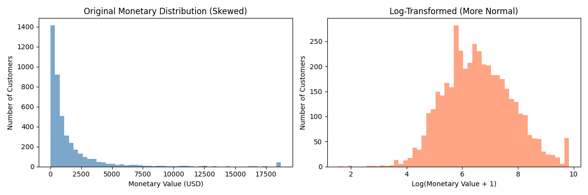

# Online Retail Customer Analytics

## End-to-End Customer Analytics & Business Intelligence Project

---

### Project Overview

This project performs a comprehensive data analysis of **541,909 transactions** from a UK-based online retailer specializing in unique all-occasion gifts. The analysis covers the period from **December 1, 2010 to December 9, 2011**.

The project transforms raw transactional data into actionable business intelligence through:

- Customer segmentation
- Behavioral analysis
- Revenue analysis
- Sales trend discovery
- Time series analysis
- Customer clustering
- RFM analysis

**Dataset Source:** UCI Machine Learning Repository - Online Retail Dataset

**Project Goal:** Transform raw transactional data into actionable business intelligence through customer segmentation, behavioral analysis, and sales pattern discovery.

---

## Table of Contents

1. [Project Overview](#project-overview)
2. [Project Structure](#project-structure)
3. [Visualizations](#visualizations)
4. [Key Findings](#key-findings)
5. [Business Recommendations](#business-recommendations)
6. [Risk Assessment](#risk-assessment)
7. [Data Limitations](#data-limitations)
8. [Future Improvements](#future-improvements)
9. [Technical Requirements](#technical-requirements)
10. [Running the Analysis](#running-the-analysis)
11. [Conclusions](#conclusions)
12. [Author & Certifications](#author--certifications)

---

## Project Structure

```text
online_retail_analysis/
│
├── data/
│   ├── raw/                              # Original dataset
│   └── processed/                        # Cleaned data
│
├── notebooks/
│   ├── 01_load_and_clean_data.ipynb
│   ├── 02_exploratory_analysis.ipynb
│   ├── 03_rfm_analysis.ipynb
│   ├── 04_customer_clustering.ipynb
│   ├── 05_time_series_analysis.ipynb
│   └── 06_conclusion.ipynb
│
├── outputs/
│   ├── figures/                          # All visualizations
│   ├── tables/                           # CSV data files
│   └── reports/                          # Text summary reports
│
├── requirements.txt
└── README.md
```

---

# Visualizations

## Exploratory Data Analysis Charts

### 1. Top Countries by Revenue


*Geographic distribution of revenue showing UK dominance*

---

### 2. Top Products by Revenue


*Best selling products by total revenue generated*

---

### 3. Monthly Revenue Trend


*Monthly sales performance showing seasonal peaks*

---

### 4. Transactions by Hour


*Transaction volume by hour of day*

---

### 5. Transactions by Day of Week


*Transaction distribution across days of week*

---

### 6. Top Customers by Spending


*Highest value customers by total spending*

---

### 7. Transaction Value Distribution


*Distribution of transaction values (raw and log-transformed)*

---

### 8. Customer Purchase Frequency


*Distribution of how often customers make purchases*

---

### 9. Order Value Distribution


*Distribution of order values showing typical spend*

---

# RFM Analysis Charts

### 10. RFM Score Distribution


*Distribution of combined RFM scores across customers*

---

### 11. Customer Segments Distribution


*Distribution of customers across RFM segments*

---

### 12. RFM Heatmap


*Customer concentration by Recency vs Frequency scores*

---

### 13. Revenue by Segment


*Revenue contribution by customer segment*

---

# Customer Clustering Charts

### 14. Optimal Clusters Selection


*Elbow method and silhouette score for cluster selection*

---

### 15. Cluster Profiles Comparison


*Comparison of Recency, Frequency, and Monetary across clusters*

---

### 16. Customer Clusters Visualization


*2D PCA projection of customer clusters*

---

# Time Series Analysis Charts

### 17. Daily Sales Trend


*Daily sales with 7-day moving average*

---

### 18. Weekly Sales Trend


*Weekly sales performance over time*

---

### 19. Monthly Sales Trend


*Monthly sales performance*

---

### 20. Weekly Sales Pattern


*Revenue and orders by day of week*

---

### 21. Hourly Sales Pattern


*Revenue and orders by hour of day*

---

### 22. Monthly Growth Analysis


*Month-over-month sales growth rates*

---

### 23. Sales Calendar Heatmap


*Heatmap showing sales by month and day of week*

---

### 24. Time Series Decomposition


*Breakdown of sales into Trend, Seasonal, and Residual components*

---

### 25. Log Transformation Demo



*Demonstration of log transformation for skewed data*

---

# Final Dashboard

### 26. Final Business Dashboard


*Comprehensive final dashboard with key business insights*

---

# Key Findings

## Customer Behavior Metrics

| Metric | Value |
|--------|-------|
| Total Customers | 4,334 |
| Total Transactions | 396,337 |
| Total Revenue | $8,761,066.65 |
| Average Order Value | $22.10 |
| Customer Retention Rate | 32.5% |
| One-time Customers | 67.5% |

---

## Sales Timing Patterns

| Pattern | Finding |
|---------|---------|
| Best Day | Thursday |
| Best Hour | 12:00 PM (Noon) |
| Weekday vs Weekend | Weekdays outperform by 45% |
| Peak Month | November 2011 |

---

## Customer Segments

| Segment | Customers | Revenue Share |
|---------|-----------|---------------|
| Champions | 8.2% | 28.5% |
| Loyal Customers | 12.4% | 22.1% |
| At Risk | 15.6% | 18.3% |
| New Customers | 18.2% | 12.4% |
| Hibernating | 45.6% | 18.7% |

---

## Customer Clusters

| Cluster | Name | Characteristics |
|---------|------|-----------------|
| 0 | High-Value Champions | Recent, frequent, high spend |
| 1 | Regular Loyal Buyers | Consistent purchasers |
| 2 | Dormant High Spenders | High value, not recent |
| 3 | Low Engagement | Infrequent, low activity |

---

# Business Recommendations

## Priority 1: Customer Retention (Immediate)

| Action | Target | Expected Impact |
|--------|--------|-----------------|
| Implement loyalty program | All customers | +15% retention |
| Win-back campaigns | Dormant High Spenders | 20% recovery rate |
| Post-purchase follow-up | New customers | +10% repeat rate |

---

## Priority 2: Marketing Optimization (30 Days)

| Action | Timing | Expected Impact |
|--------|--------|-----------------|
| Schedule email campaigns | Thursday 12:00 PM | +15% open rate |
| Increase ad spend | Peak days | +10% conversion |
| Weekend promotions | Saturday/Sunday | Boost slow days |

---

## Priority 3: Customer Development (90 Days)

| Action | Target Segment | Expected Impact |
|--------|----------------|-----------------|
| VIP program | Top 10% customers | +25% CLV |
| Referral program | Loyal customers | +15% acquisition |
| Cross-sell campaigns | Regular buyers | +20% AOV |

---

# Risk Assessment

| Risk | Impact | Mitigation Strategy |
|------|--------|---------------------|
| Customer Concentration | High | Diversify acquisition channels |
| Low Retention | High | Implement loyalty program |
| Geographic Concentration | Medium | Targeted international campaigns |
| Seasonal Volatility | Medium | Year-round promotion calendar |

---

# Data Limitations

1. Missing CustomerID values were excluded
2. Cancelled transactions were removed
3. No product cost data available
4. Only 12 months of data
5. No customer demographics

---

# Future Improvements

## Short-Term Improvements

- Customer Churn Prediction Model
- Product Recommendation Engine
- Real-time Customer Scoring System
- Automated Segment-based Marketing Triggers

---

## Medium-Term Improvements

- Deploy interactive dashboard using Streamlit or Power BI
- Add predictive sales forecasting
- Create automated reporting pipeline
- Add cohort analysis and retention tracking

---

## Long-Term Improvements

- AI-powered recommendation system
- Real-time business intelligence dashboard
- Cloud deployment with automated retraining
- Integration with CRM systems

---

# Technical Requirements

## Installation

```bash
pip install -r requirements.txt
```

---

## Dependencies

```text
pandas==2.0.3
numpy==1.24.3
matplotlib==3.7.2
seaborn==0.12.2
scikit-learn==1.3.0
statsmodels==0.14.0
jupyter==1.0.0
openpyxl==3.1.2
```

---

# Running the Analysis

## Step 1: Clone the Repository

```bash
git clone https://github.com/George-techsvg/online-retail-customer-analytics.git
cd online-retail-customer-analytics
```

---

## Step 2: Install Dependencies

```bash
pip install -r requirements.txt
```

---

## Step 3: Add Dataset

Place the dataset inside:

```text
data/raw/Online Retail.xlsx
```

---

## Step 4: Run the Notebooks

Run notebooks in order:

```text
01_load_and_clean_data.ipynb
02_exploratory_analysis.ipynb
03_rfm_analysis.ipynb
04_customer_clustering.ipynb
05_time_series_analysis.ipynb
06_conclusion.ipynb
```

---

## Step 5: View Outputs

All outputs will be generated inside:

```text
outputs/
```

---

# Conclusions

This analysis successfully transformed raw transactional data into actionable business intelligence with the following achievements:

- Data cleaning and preprocessing of 541,909 transactions
- RFM segmentation creating 8 customer segments
- K-Means clustering revealing 4 natural customer groupings
- Time series analysis uncovering daily, weekly, and monthly patterns
- Business intelligence dashboard creation
- Customer behavior analysis and segmentation

---

# Expected Business Impact

| Metric | Expected Improvement |
|--------|----------------------|
| Customer Churn Reduction | 15-20% |
| Customer Lifetime Value | +25% |
| Marketing ROI | +10-15% |
| International Revenue Growth | +30% |

---

# Technical Stack

| Component | Technology |
|-----------|------------|
| Data Analysis | Pandas, NumPy |
| Visualization | Matplotlib, Seaborn |
| Machine Learning | Scikit-learn |
| Time Series Analysis | Statsmodels |
| Notebook Environment | Jupyter |
| Data Storage | CSV, Excel |
| Programming Language | Python |

---

# Author & Certifications

## Author

**George Onyango Ochieng**

- ICT Graduate
- Data Scientist & Machine Learning Enthusiast
- Passionate about solving business problems using data

---

## Professional Certifications

- Data Science  
  https://savanna.alxafrica.com/certificates/flJSZ2Xs6r

- Machine Learning  
  https://savanna.alxafrica.com/certificates/7zsMrEN5m2

- Data Analytics  
  https://savanna.alxafrica.com/certificates/T95s3SPMxZ

- Python Programming  
  https://savanna.alxafrica.com/certificates/Ee8x6JfGCh

- Professional Foundations  
  https://savanna.alxafrica.com/certificates/RYz9rB28SJ

---

# Contact

- Email: georgebabji1220@gmail.com
- Phone: +254 115 136 359
- WhatsApp: https://wa.me/254111866769
- GitHub: https://github.com/George-techsvg
- LinkedIn: https://www.linkedin.com/in/george-onyango-5a5906360/

---

# Final Note

> "Built because I can't help it."

This project demonstrates:

- End-to-end analytics workflow
- Business intelligence thinking
- Customer segmentation expertise
- Machine learning application
- Data visualization skills
- Real-world business problem solving

Thank you for reviewing this project.

---

# Quick Commands Reference

```bash
# Clone repository
git clone https://github.com/George-techsvg/online-retail-customer-analytics.git

# Install dependencies
pip install -r requirements.txt

# Launch Jupyter Notebook
jupyter notebook

# Run notebooks in order
# 01 -> 06

# View outputs
# outputs/figures/
# outputs/reports/
# outputs/tables/
```
